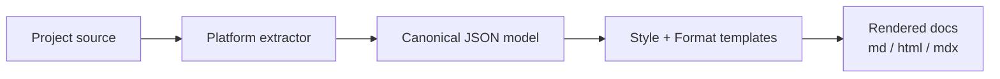

# doc-gen

Generate API reference documentation for a project from platform-native intermediate formats (e.g. .NET compiler XML, javadoc XML via [xml-doclet](https://github.com/cloudblue/xml-doclet), Dokka, TypeDoc) into a pluggable **style + format** template system.

## Pipeline



1. **Orchestrator** ([doc-gen.agent.md](doc-gen.agent.md)) discovers projects and dispatches per-language subagents.
2. **Language subagent** (e.g. [doc-gen-dotnet.agent.md](doc-gen-dotnet.agent.md)) runs the platform extractor and normalizes the result into a canonical JSON model ([shared/canonical-schema.md](shared/canonical-schema.md)).
3. **Renderer** ([scripts/render.ps1](scripts/render.ps1)) consumes the canonical model and a style/format template set to emit one file per documented element.

## Layout

```
doc-gen/
  doc-gen.agent.md                orchestrator
  doc-gen-dotnet.agent.md         implemented
  doc-gen-java.agent.md           scaffold (TODO)
  doc-gen-kotlin.agent.md         scaffold (TODO)
  doc-gen-typescript.agent.md     scaffold (TODO)
  doc-gen-javascript.agent.md     scaffold (TODO)
  preferences.yaml                default style / format / output dir
  scripts/
    check-prereqs.ps1             PS7 + dotnet checks
    discover-projects.ps1         detect project type per folder
    extract-dotnet.ps1            build with GenerateDocumentationFile
    normalize-dotnet.ps1          xml + reflection → canonical JSON
    render.ps1                    canonical JSON + templates → files
  shared/
    canonical-schema.md           model contract (read this first)
    token-dictionary.md           human-readable label map
    token-dictionary.json         renderer-consumed label map
  resources/styles/
    README.md                     style/format extension rules
    msdn/
      style.yaml
      md/
        class.md, method.md, constructor.md, property.md,
        field.md, operator.md, enum.md, namespace-index.md
        partials/
          definition.md, definition-member.md, remarks.md,
          parameters.md, type-parameters.md, returns.md,
          exceptions.md, examples.md, applies-to.md,
          thread-safety.md, see-also.md,
          members-table-*.md
```

## Supported languages

| Language | Extractor | Status |
|---|---|---|
| .NET (C#) | csc XML docs (`GenerateDocumentationFile`) + reflection | **Implemented** |
| Java | javadoc + [xml-doclet](https://github.com/cloudblue/xml-doclet) | Scaffold |
| Kotlin | Dokka | Scaffold |
| TypeScript | `typedoc --json` | Scaffold |
| JavaScript | `jsdoc -X` | Scaffold |

## Adding a style

See [resources/styles/README.md](resources/styles/README.md). A style is a folder under `resources/styles/`; every **format** under it (`md`, `html`, `mdx`, …) must provide the required templates listed there. Style-level options (colors, feature flags) go in `style.yaml`.

## Adding a language

1. Create `doc-gen-<lang>.agent.md` (use one of the scaffolds as a template).
2. Add `<lang>` to the `agents:` list in [doc-gen.agent.md](doc-gen.agent.md).
3. Extend [scripts/discover-projects.ps1](scripts/discover-projects.ps1) with a detection rule.
4. Add a language column to every token in [shared/token-dictionary.json](shared/token-dictionary.json).
5. Author `scripts/normalize-<lang>.ps1` that produces a canonical JSON conformant to [shared/canonical-schema.md](shared/canonical-schema.md).

## CLI (for testing scripts directly)

```pwsh
# .NET: build + normalize + render end-to-end
$build = pwsh -File scripts/extract-dotnet.ps1 -ProjectPath 'src/MyLib' -Manifest 'MyLib.csproj' | ConvertFrom-Json
pwsh -File scripts/normalize-dotnet.ps1 `
    -XmlPath $build.xml -AssemblyPath $build.assembly `
    -OutputModel .\canonical.json
pwsh -File scripts/render.ps1 `
    -ModelPath .\canonical.json -Style msdn -Format md `
    -OutputDir .\docs\api\msdn\md
```

## Constraints

- Never modifies source files or project manifests. Build flags are passed on the command line only.
- Never commits. Hand off to `ship-it` after review.
- No network calls at runtime (the renderer and normalizers are offline).
